# FPT 架构文档

> Flapping Platform Terminal — 模块划分与架构设计详解

---

## 目录

- [系统总览](#系统总览)
- [分层架构](#分层架构)
- [模块依赖关系](#模块依赖关系)
- [核心类关系图](#核心类关系图)
- [数据流](#数据流)
- [设计模式](#设计模式)
- [设备扩展机制](#设备扩展机制)

---

## 系统总览

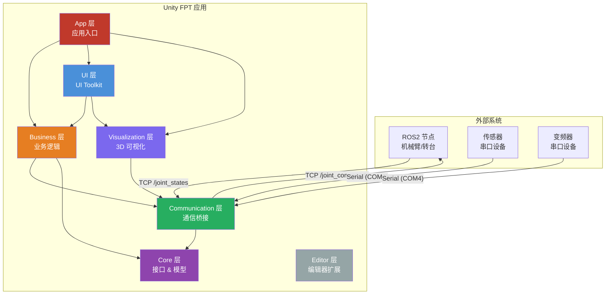

---

## 分层架构

项目采用 **五层分层架构**，自上而下依赖，职责清晰分离：

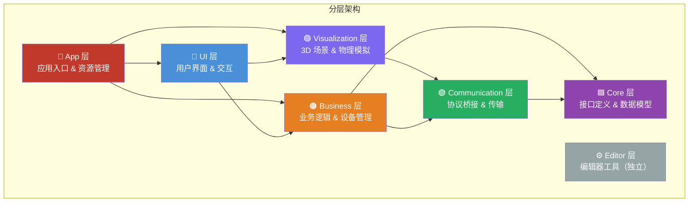

### 各层职责

| 层 | Assembly | 命名空间 | 职责 | 依赖 |
|----|----------|----------|------|------|
| **App** | `FPT.App` | `FPT.App` | 应用入口、资源管理、场景配置 | 所有模块 |
| **UI** | `FPT.UI` | `FPT.UI` | UI Toolkit 界面（UXML/USS）、用户交互 | Business, Visualization |
| **Visualization** | `FPT.Visualization` | `FPT.Visualization` | 3D 场景渲染、关节物理驱动、相机控制 | Communication, Business |
| **Business** | `FPT.Business` | `FPT.Business` | 设备管理、驱动实现、命令管道、状态机 | Core, Communication |
| **Communication** | `FPT.Communication` | `FPT.Communication` | ROS2 桥接、串口传输、协议编解码、消息路由 | Core |
| **Core** | `FPT.Core` | `FPT.Core` | 接口定义、数据模型、命令类型、枚举 | 无 |
| **Editor** | `FPT.Editor` | `FPT.Editor` | 编辑器工具（USS绑定、材质修复、灯光设置） | 独立 |

---

## 模块依赖关系

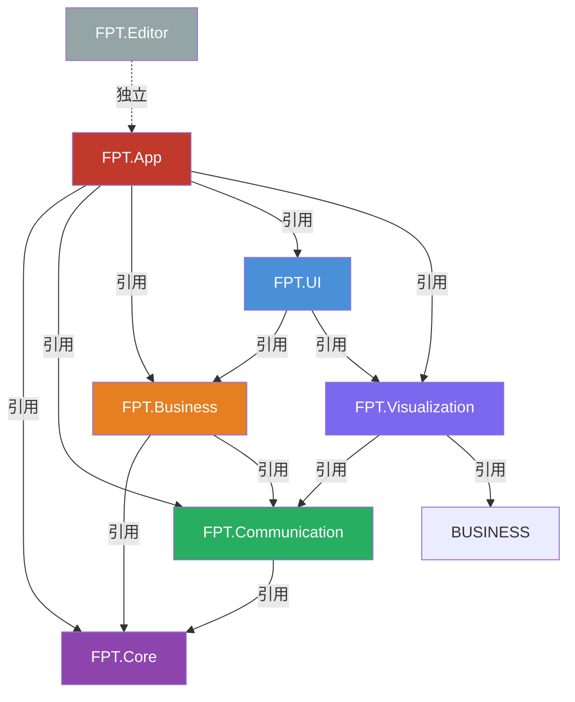

---

## 核心类关系图

### Core 层 — 接口与模型

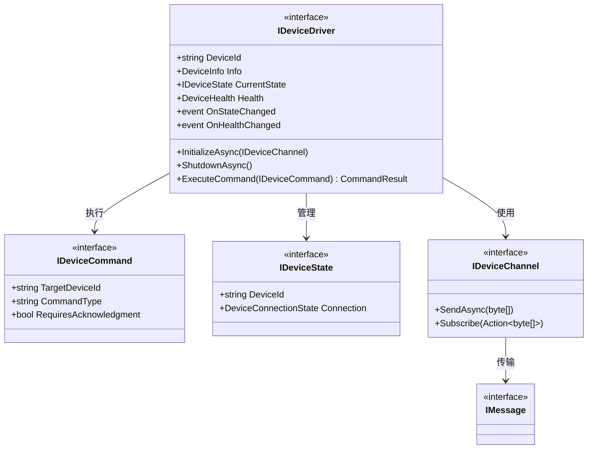

### 命令类型

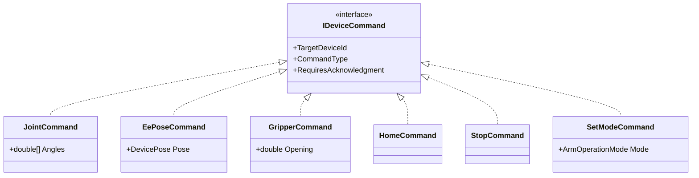

### Business 层 — 驱动与管理

```mermaid
classDiagram
    class AppContext {
        <<MonoBehaviour Singleton>>
        +Ros2Bridge Ros2Bridge
        +CommunicationManager CommManager
        +DeviceManager DeviceManager
        +DeviceCoordinator Coordinator
        +RobotArmDriver ArmDriver
        +AnimationDemoController AnimationDemo
        +ConnectRos2()
    }

    class DeviceManager {
        +RegisterDriver(IDeviceDriver)
        +InitializeAllAsync()
        +ShutdownAllAsync()
        +GetDriver(string) IDeviceDriver
        +AllStates Dictionary
    }

    class DeviceDriverBase {
        <<abstract>>
        +string DeviceId
        +ExecuteCommand(IDeviceCommand) CommandResult
    }

    class RobotArmDriver {
        +Bind(Ros2Bridge)
    }
    class SensorDriver
    class VfdMotorDriver
    class TurntableDriver

    class CommandPipeline {
        +AddInterceptor(ICommandInterceptor)
        +Execute(command, state, send) CommandResult
    }

    class ICommandInterceptor {
        <<interface>>
        +Name
        +Intercept(cmd, state) CommandResult
    }

    class JointLimitInterceptor
    class SpeedLimitInterceptor

    class DeviceCoordinator {
        +Subscribe()
    }

    class DeviceStateMachine {
        +CurrentState
        +Transition()
    }

    AppContext --> DeviceManager
    AppContext --> Ros2Bridge
    AppContext --> CommunicationManager
    DeviceManager --> DeviceDriverBase : 管理
    DeviceDriverBase <|-- RobotArmDriver
    DeviceDriverBase <|-- SensorDriver
    DeviceDriverBase <|-- VfdMotorDriver
    DeviceDriverBase <|-- TurntableDriver
    RobotArmDriver --> CommandPipeline
    CommandPipeline --> ICommandInterceptor
    ICommandInterceptor <|.. JointLimitInterceptor
    ICommandInterceptor <|.. SpeedLimitInterceptor
    DeviceCoordinator --> DeviceManager
```

### Communication 层 — 通信架构

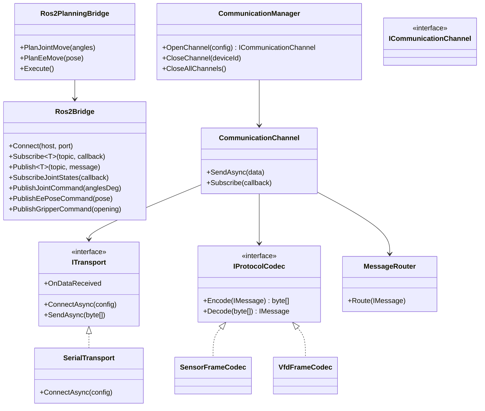

### UI 层 — 控制器

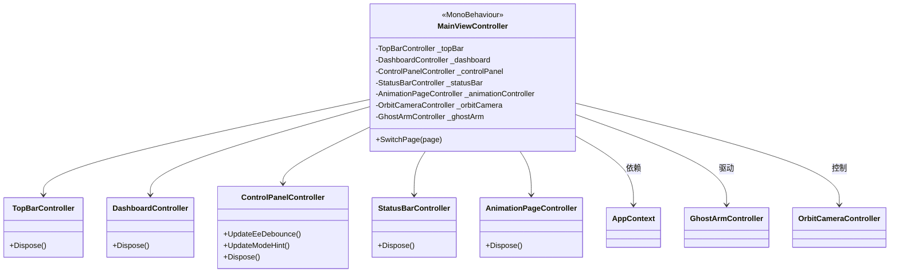

### Visualization 层

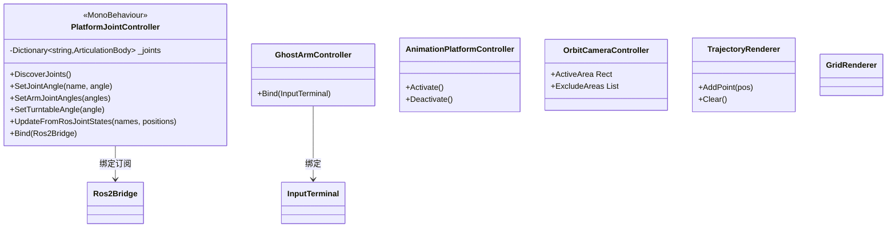

---

## 数据流

### 命令流（用户操作 → 设备执行）

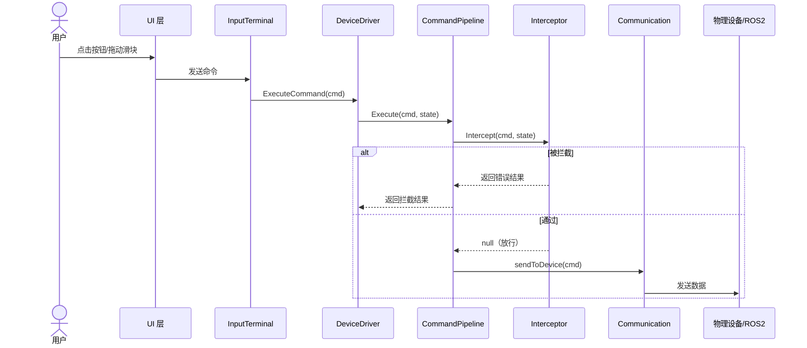

### 状态流（设备 → UI 更新）

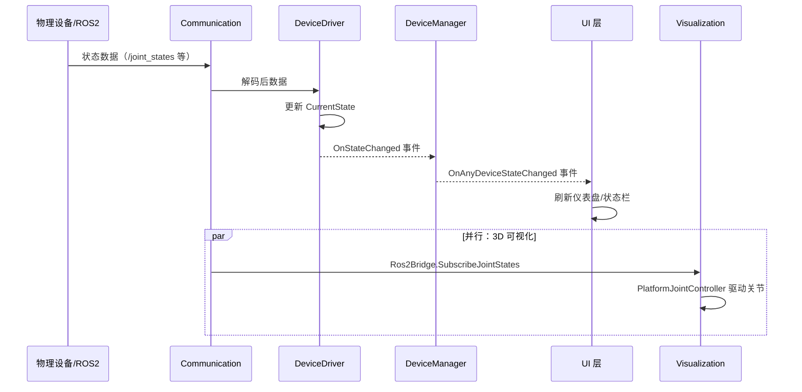

---

## 设计模式

| 模式 | 位置 | 说明 |
|------|------|------|
| **单例 (Singleton)** | `AppContext` | 全局唯一应用入口，管理所有服务生命周期 |
| **策略 (Strategy)** | `IDeviceDriver` / `IDeviceCommand` | 设备驱动和命令的多态抽象，新增设备只需实现接口 |
| **责任链 (Chain of Responsibility)** | `CommandPipeline` + `ICommandInterceptor` | 命令经过拦截器链预处理（限位、速度限制等） |
| **观察者 (Observer)** | `OnStateChanged` / `OnHealthChanged` | 事件驱动的状态同步，UI 层订阅设备状态变更 |
| **桥接 (Bridge)** | `Ros2Bridge` | 将 ROS2 协议栈封装为 FPT 统一接口 |
| **MVC/MVP** | UI Toolkit Controllers | MainViewController 管理子控制器，分离视图与业务 |
| **状态机 (State Machine)** | `DeviceStateMachine` | 管理设备连接/运行/错误等状态转换 |
| **工厂方法 (Factory Method)** | `CommunicationManager.CreateCodecForDevice` | 根据设备类型创建对应的协议编解码器 |
| **中介者 (Mediator)** | `DeviceCoordinator` | 协调多设备之间的联动关系 |
| **命令 (Command)** | `IDeviceCommand` 及子类 | 将操作封装为对象，支持队列、拦截、撤销 |

---

## 设备扩展机制

新增设备的完整步骤：

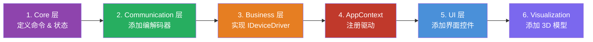

### 现有设备

| 设备 | Driver | 通信方式 | 通信对象 | 状态类 |
|------|--------|----------|----------|--------|
| 6 轴机械臂 | `RobotArmDriver` | ROS2 TCP | `Ros2Bridge` | `RobotArmState` |
| 转台 | `TurntableDriver` | 预留 | — | `TurntableState` |
| 传感器 | `SensorDriver` | 串口 | `SerialTransport` + `SensorFrameCodec` | `SensorState` |
| 变频器 | `VfdMotorDriver` | 串口 | `SerialTransport` + `VfdFrameCodec` | `VfdMotorState` |

---

## 项目资源

| 资源类型 | 路径 | 说明 |
|----------|------|------|
| 主场景 | `Assets/Scenes/SampleScene.unity` | 主运行场景 |
| 机械臂 URDF | `Assets/FPT/Visualization/Runtime/flapping_platform_prefabs/` | flapping_platform.urdf 及预制体 |
| 鹰模型 | `Assets/bodymodel/BaldEagle/` | 白头鹰 3D 模型（FBX + 材质 + 动画） |
| UI 字体 | `Assets/FPT/UI/Runtime/Resources/` | 微软雅黑 + NotoSansSymbols |
| ROS2 预制体 | `Assets/Resources/ROSConnectionPrefab.prefab` | ROS TCP 连接预设 |
| UI 规范文档 | `Assets/UI_Toolkit_Development_Specification.md` | UI Toolkit 开发规范 |

---

> **FPT 开发团队** | 最后更新: 2026-06-24